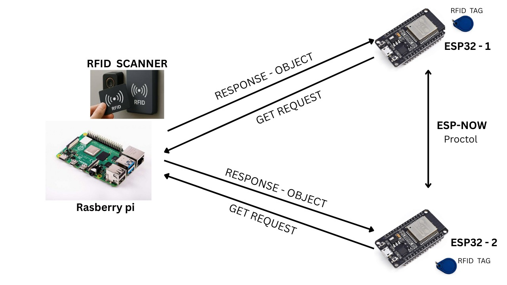
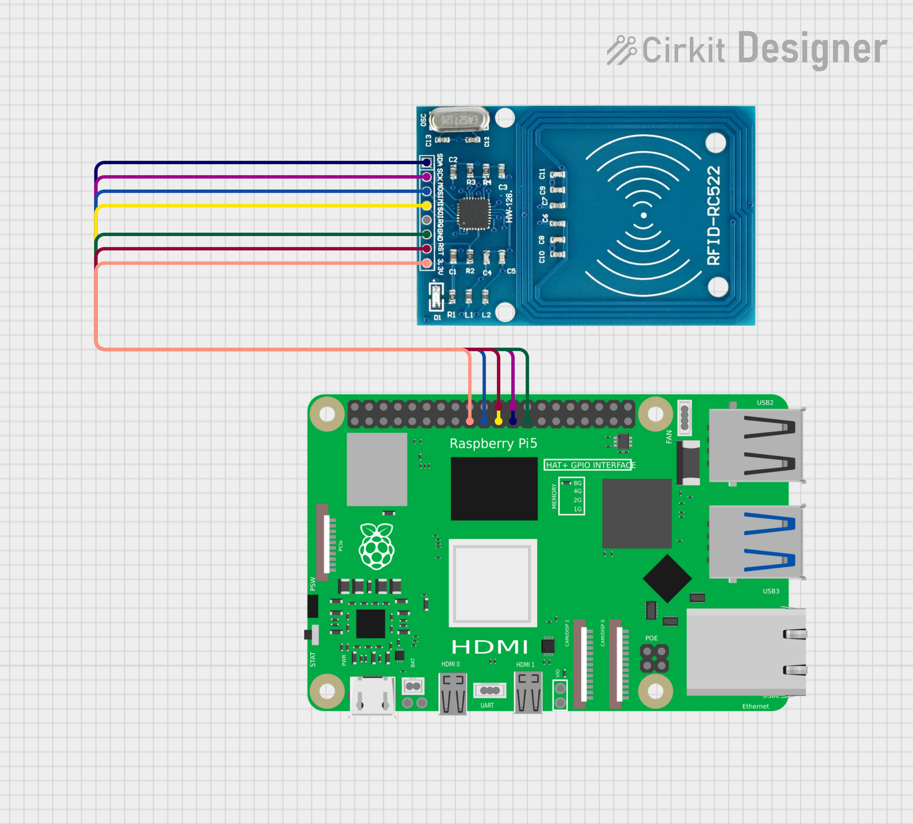
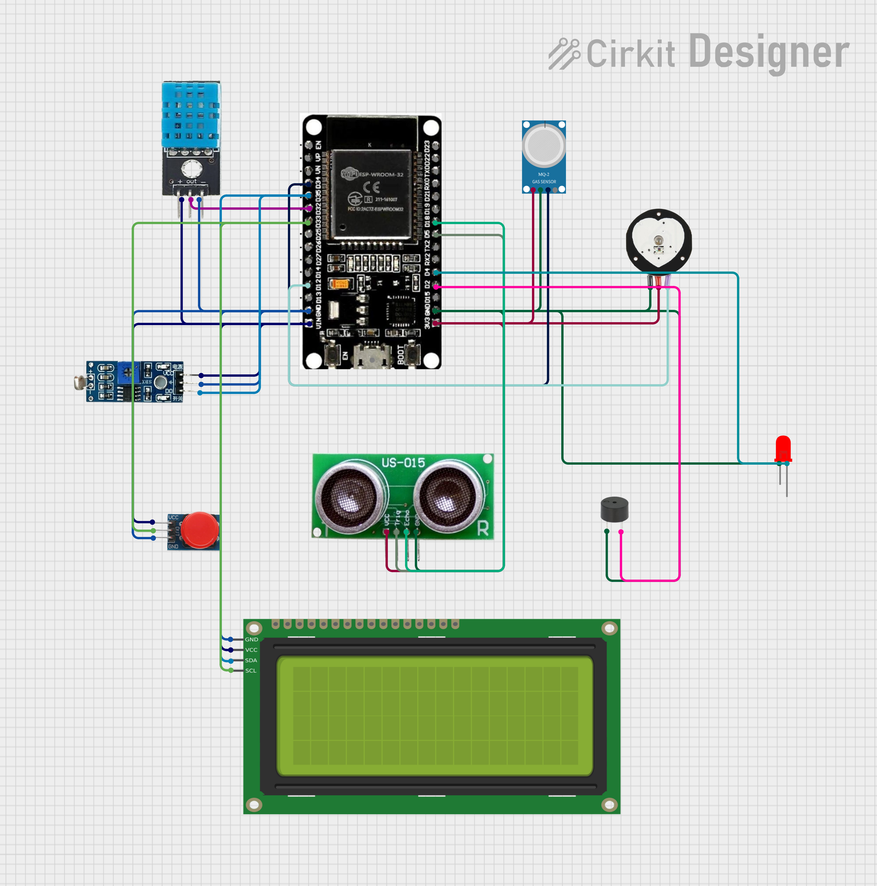

# 🧥 Smart Jacket — IoT Worker Safety Monitoring System


> An IoT-enabled wearable safety system that monitors worker health and environment in real-time, transmitting encrypted sensor data to an edge server with built-in cybersecurity defences.

---

## 📌 Table of Contents

- [Overview](#-overview)
- [System Architecture](#-system-architecture)
- [Hardware Requirements](#-hardware-requirements)
- [Software Requirements](#-software-requirements)
- [Circuit Diagrams](#-circuit-diagrams)
- [Setup Instructions](#-setup-instructions)
- [Security Implementation](#-security-implementation)
- [Project Structure](#-project-structure)
- [Important Notes](#-important-notes)
- [Authors](#-authors)

---

## 🔍 Overview

Smart Jacket is a wearable IoT device built for worker safety in hazardous environments. Two ESP32-powered jackets continuously monitor physiological and environmental data — including heart rate, temperature, gas levels, and proximity — and transmit it securely to a Raspberry Pi edge server.

The system also implements three layers of cybersecurity defence: firewall rules against DoS attacks, Fail2Ban for brute-force SSH protection, and AES-128 encryption for all data transmission.

---

## 📐 System Architecture



The system consists of three main nodes:

| Node | Role |
|------|------|
| **Raspberry Pi** | Local edge server and central processing hub |
| **ESP32-1 & ESP32-2** | Microcontrollers embedded in jackets — send data to RPi via HTTP, communicate with each other via ESP-NOW |
| **RFID Scanner** | Connected to RPi for worker identity verification |

**Communication flow:**
```
ESP32 Jacket 1  ──HTTP GET──▶  Raspberry Pi (Flask Server)
ESP32 Jacket 2  ──HTTP GET──▶  Raspberry Pi (Flask Server)
ESP32 Jacket 1  ◀──ESP-NOW──▶  ESP32 Jacket 2
RFID Scanner    ──SPI──▶       Raspberry Pi
```

---

## 🧰 Hardware Requirements

| Component | Qty | Purpose |
|-----------|-----|---------|
| ESP32 | ×2 | Microcontroller with Wi-Fi/Bluetooth for IoT communication |
| Raspberry Pi | ×1 | Local edge server and processing hub |
| RFID-RC522 + Tags | ×2 | Worker identity verification |
| DHT11 | ×2 | Body temperature and humidity monitoring |
| MQ-2 Gas Sensor | ×2 | Detection of hazardous gases and smoke |
| Pulse Sensor | ×2 | Heart rate monitoring |
| Ultrasonic Sensor (US-015) | ×2 | Proximity and distance detection |
| 16×2 I2C LCD Display | ×2 | Local data display on jacket |
| Buzzer + LED | ×2 | Alert indicators |
| Push Button | ×2 | Manual input trigger |

---

## 💻 Software Requirements

| Software | Purpose |
|----------|---------|
| Arduino IDE | Programming the ESP32 microcontrollers |
| Python 3 | Backend scripting and data handling |
| Raspberry Pi OS | Server operating system |
| Flask | Python web framework for the local API server |
| `pycryptodome` | AES-128 encryption library |
| Fail2Ban | Intrusion prevention on the Raspberry Pi |
| Metasploit (MSF) | DoS attack simulation — testing only |
| Medusa | Brute-force SSH testing — testing only |

---

## 🔌 Circuit Diagrams

### Server — Raspberry Pi + RFID-RC522



The RFID-RC522 module connects to the Raspberry Pi 5 via SPI pins:

| RFID-RC522 Pin | Raspberry Pi Pin |
|----------------|-----------------|
| SDA | GPIO 8 (CE0) |
| SCK | GPIO 11 (SCLK) |
| MOSI | GPIO 10 |
| MISO | GPIO 9 |
| RST | GPIO 25 |
| 3.3V | 3.3V |
| GND | GND |

### Jacket — ESP32 + Sensors



Each jacket's ESP32 is wired to:

| Sensor / Component | Purpose |
|--------------------|---------|
| DHT11 | Temperature & humidity |
| MQ-2 | Gas / smoke detection |
| Pulse Sensor | Heart rate monitoring |
| Ultrasonic (US-015) | Proximity detection |
| LCD (I2C) | Local data display |
| Push Button | Manual trigger |
| Buzzer + LED | Alerts and notifications |

---

## ⚙️ Setup Instructions

### 1. Flash the ESP32s

1. Open **Arduino IDE** and install the ESP32 board package
2. Install required libraries: `DHT`, `MFRC522`, `LiquidCrystal_I2C`, `esp_now`, `WiFi`
3. Flash **jacket1.ino** onto ESP32-1
4. For ESP32-2, update only the **MAC address constant** in the code, then flash **jacket2.ino**

> ⚠️ Note the MAC address of each ESP32 before flashing — it is required for ESP-NOW pairing.

---

### 2. Wire Up the Circuits

Follow the circuit diagrams above precisely. Key connections:
- RFID-RC522 → Raspberry Pi via SPI (see RPI circuit diagram)
- All sensors → respective ESP32 GPIO pins (see jacket circuit diagram)

---

### 3. Set Up the Raspberry Pi Server

```bash
# Update system
sudo apt update && sudo apt upgrade -y

# Install Python dependencies
pip install flask pycryptodome

# Clone this repository
git clone <your-repo-url>
cd <repo-folder>

# Run the Flask server
python server.py
```

The server will start listening for HTTP GET requests from both ESP32 jackets.

---

### 4. Configure Wi-Fi on ESP32s

In the ESP32 Arduino code, update these lines with your local network credentials:

```cpp
const char* ssid     = "YOUR_WIFI_SSID";
const char* password = "YOUR_WIFI_PASSWORD";
const char* serverURL = "http://<RPI_IP_ADDRESS>/data";
```

---

### 5. Test the System

Power both jackets. Each should:
1. Connect to Wi-Fi
2. Read all sensor values
3. Encrypt and send data to the RPi server via HTTP GET
4. Communicate with the other jacket via ESP-NOW
5. Display readings on the I2C LCD

---

## 🔒 Security Implementation

The system implements three layers of cybersecurity defence:

### Layer 1 — DoS Attack Defence (IPTables Firewall)

Limits incoming TCP SYN packets to prevent flooding attacks:

```bash
# Allow max 1 SYN packet/sec with burst of 3
sudo iptables -A INPUT -p tcp --syn -m limit --limit 1/s --limit-burst 3 -j ACCEPT

# Drop all excess SYN packets
sudo iptables -A INPUT -p tcp --syn -j DROP
```

---

### Layer 2 — Brute Force Defence (Fail2Ban)

Blocks repeated failed SSH login attempts automatically:

```bash
# Install Fail2Ban
sudo apt-get install fail2ban

# Start the service
sudo systemctl start fail2ban

# Check SSH jail status
sudo fail2ban-client status sshd
```

---

### Layer 3 — Data Encryption (AES-128)

All sensor data packets are AES-128 encrypted before transmission between the ESP32 and Raspberry Pi:

```python
from Crypto.Cipher import AES
import base64

def encrypt_data(data, key):
    cipher = AES.new(key, AES.MODE_ECB)
    padded_data = pad(data)
    encoded = base64.b64encode(cipher.encrypt(padded_data))
    return encoded
```

---

## 📁 Project Structure

```
SmartJacket/
├── jacket_esp32/
│   ├── jacket1.ino           # Code for ESP32-1
│   └── jacket2.ino           # Code for ESP32-2 (same logic, different MAC)
├── server/
│   └── server.py             # Flask API running on Raspberry Pi
├── architecture.jpeg         # System architecture diagram
├── RPI-server-circuit.png    # Raspberry Pi wiring diagram
├── jacket-circuit.png        # ESP32 jacket wiring diagram
└── README.md
```

---

## ⚠️ Important Notes

- **Library versions** — Always verify library and board package versions before flashing. ESP32 is sensitive to compatibility issues between versions.
- **HTTP stability** — The ESP32 can occasionally hang on HTTP transactions with Flask. Add retry logic and error handling in the Arduino code.
- **ESP-NOW vs FreeRTOS** — The system uses the standard `setup()`/`loop()` method. FreeRTOS is an option but is memory-heavy and requires careful heap allocation.
- **Component quality** — Higher-quality sensors and components significantly reduce read errors and improve system stability.
- **Second jacket** — Jacket 2 is identical to Jacket 1. Only the MAC address constant needs to be changed before flashing.
- **Security tools** — Metasploit and Medusa are used strictly for testing the system's defences. Never use them on networks you do not own.

---

## 👥 Authors

**Pushkar Joshi**
- GitHub: [@pushkarjoshi2998](https://github.com/pushkarjoshi2998)
- LinkedIn: [Pushkar Joshi](https://www.linkedin.com/in/pushkar-joshi-653bb3335/)

**Kunal**
- GitHub: [@kunalusername](https://github.com/kunalusername)
- LinkedIn: [Kunal](https://linkedin.com/in/kunalprofile)

---

> Built as an IoT + cybersecurity project combining embedded systems (ESP32, Raspberry Pi), real-time sensor monitoring, wireless communication protocols (HTTP, ESP-NOW, SPI), and multi-layer network security. 🔒
